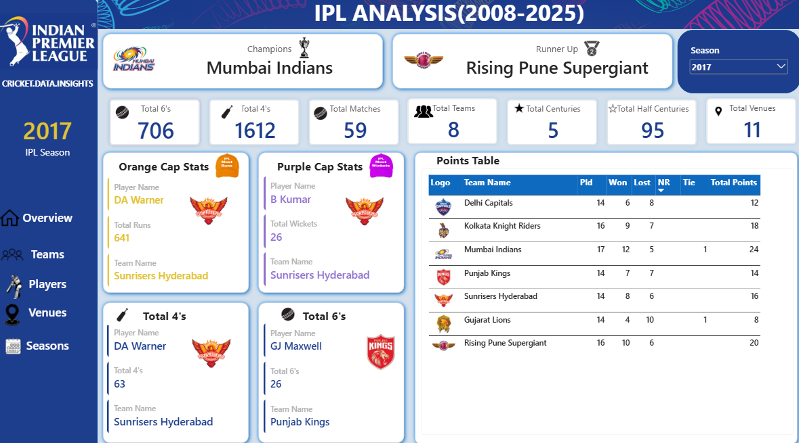

# 🏏 IPL Analysis Dashboard — Power BI

An interactive **IPL Analysis Dashboard** built using **Microsoft Power BI** to explore and analyze Indian Premier League (IPL) data across seasons, teams, players, and venues.

The dashboard provides an interactive way to understand IPL performance through dynamic filters, KPIs, charts, team logos, and player statistics.

---

## 📊 Dashboard Preview





## 🎯 Project Objective

The objective of this project is to analyze IPL match and ball-by-ball data and transform it into an interactive business intelligence dashboard.

The dashboard helps users explore:

- Season-wise IPL performance
- Team performance
- Player performance
- Venue statistics
- Season winners and runners-up
- Orange Cap and Purple Cap players
- Top run scorers
- Top wicket takers
- Players with the most fours and sixes
- Team wins, losses, and win percentage
- Match and venue statistics

The project demonstrates how raw cricket data can be transformed into meaningful insights using **Power BI, DAX, data modeling, and visualization**.

---

# 🛠️ Tools & Technologies

| Tool / Technology | Purpose |
|---|---|
| **Power BI** | Dashboard development and visualization |
| **DAX** | Measures, calculations, KPIs, and dynamic analysis |
| **Power Query** | Data cleaning and transformation |
| **Excel / CSV** | Data source and data preparation |
| **Data Modeling** | Relationships between match and ball-by-ball data |

---

# 📂 Dataset

The project uses IPL match-level and ball-by-ball data.

### Main tables

#### 1. `ipl_matches_data`

Contains match-level information such as:

- Match ID
- Season
- Match date
- Venue
- City
- Team 1
- Team 2
- Toss winner
- Toss decision
- Match winner
- Win by runs
- Win by wickets
- Player of the Match
- Match stage

#### 2. `ball_by_ball_data`

Contains ball-by-ball information such as:

- Batter
- Batter runs
- Batting team
- Bowling information
- Ball-level match data

This table is used for player-level analysis such as:

- Runs
- Fours
- Sixes
- Wickets
- Top performers

#### 3. `teams_data`

Contains team information:

- Team name
- Team logo/image URL

This table is used to display team logos dynamically in the dashboard.

#### 4. `All Teams`

A calculated helper table containing all teams appearing across the IPL match data.

It allows historical teams to be included in the Teams page, including teams whose names may not exist in the current team-logo table.

---

# 📑 Dashboard Pages

The dashboard contains five main pages.

---

## 🏠 1. Overview

The Overview page provides a high-level summary of the IPL dataset.

### Key KPIs

- Total Matches
- Total Teams
- Total Venues
- Total Fours
- Total Sixes

### Key Information

- Season Winner
- Winner Logo
- Runner-up
- Runner-up Logo

### Interactivity

A **Season slicer** allows users to select a particular IPL season and dynamically update the dashboard.

For example:

Selecting a season such as `2025` updates:

- Winner
- Runner-up
- Winner logo
- Runner-up logo
- Match statistics
- Other season-dependent visuals

---

# 👥 2. Teams

The Teams page focuses on team-level performance.

### Features

- Team selection slicer
- Selected team logo
- Matches played
- Matches won
- Matches lost
- Win percentage
- Best season
- Season-wise team performance

### KPIs

```text
Matches Played
Matches Won
Matches Lost
Win %
Best Season
